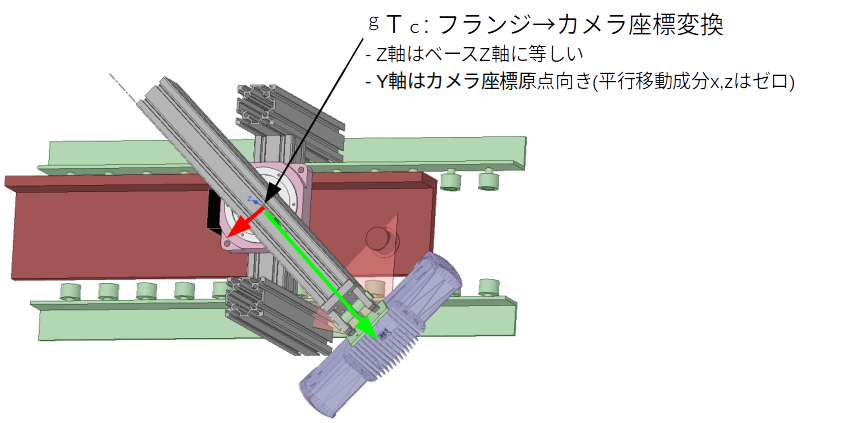

# DoF(自由度)<6の場合のキャリブレーション検討
## 直交ロボット(DoF==3)
### 基本式
不動のキャリブ板を、ハンドアイカメラから見たときの座標変換は以下の数式にて表される。
$${}^{W}T_{P}={}^{W}T_{M}{}^{M}T_{C}{}^{C}T_{P}$$
SuffixのWはワールド、Pはボード、Mはロボット、Cはカメラ座標系である。上式を回転部分行列R、並進部分行列&Lambda;に分けて記述すると以下となる。
$$\left[\begin{array}{ccc|c}
&&&\\
&\smash{\huge{{}^{W}R_P}}&&\smash{\huge{{}^{W}\Lambda_P}}\\
&&&\\ \hline
0&0&0&1
\end{array}\right]=
\left[\begin{array}{ccc|c}
&&&\\
&\smash{\huge{{}^{W}R_M}}&&\smash{\huge{{}^{W}\Lambda_M}}\\
&&&\\ \hline
0&0&0&1
\end{array}\right]
\left[\begin{array}{ccc|c}
&&&\\
&\smash{\huge{{}^{M}R_C}}&&\smash{\huge{{}^{M}\Lambda_C}}\\
&&&\\ \hline
0&0&0&1
\end{array}\right]
\left[\begin{array}{ccc|c}
&&&\\
&\smash{\huge{{}^{C}R_P}}&&\smash{\huge{{}^{C}\Lambda_P}}\\
&&&\\ \hline
0&0&0&1
\end{array}\right]
$$

### ボード姿勢成分
上式からボード姿勢成分<i>WRP</i>を取り出すと以下となる。
$${}^{W}R_{P}={}^{W}R_{M}{}^{M}R_{C}{}^{C}R_{P}$$
さらに直交ロボットでは<i>WRM</i>は単位行列となるため
$${}^{W}R_{P}={}^{M}R_{C}{}^{C}R_{P}$$
となる。また直交ロボットではカメラから見たボード姿勢も変化しない。このためロボットをどの位置に動かしても上式は不変となり求解に必要な式を得ることができない。

### ボード並進成分
同様にボード並進成分は以下となる。
$${}^{W}\Lambda_{P}={}^{W}R_{M}{}^{M}R_{C}{}^{C}\Lambda_P+{}^{W}R_{M}{}^{M}\Lambda_C+{}^{W}\Lambda_M$$
この式を元に球キャリブ(<i>CRP</i>なし)の求解できるはず
<i>WRM=I</i>より
$${}^{W}\Lambda_{P}={}^{M}R_{C}{}^{C}\Lambda_P+{}^{M}\Lambda_C+{}^{W}\Lambda_M$$
上式はロボットを移動させることで任意の数の式を得ることができるため、求解可能である。
この常套手段は<b>ボードが動かない</b>という条件を用いて2つの式の差を誤差評価関数と定義し最小化手法にて未定定数を決定するものである。ロボット2か所での差から下式を得る。
$$\varepsilon={}^{M}R_{C}({}^{C}\Lambda_{P1}-{}^{C}\Lambda_{P2})+{}^{W}\Lambda_{M1}-{}^{W}\Lambda_{M2}$$
誤差を取ると<i>M&Lambda;C</i>が消えることに注意が必要です。つまり直交ロボットに対して従来のキャリブ手段では、姿勢成分を求めることは可能ですが、並進成分を求めることはできません。

## 回転台(DoF==1)
ターンテーブルのような１軸回転機構によってカメラが回転する装置の、回転機構の座標系に対してカメラ座標系を較正するケースです。ターンテーブルはその土台の座標系(添字b)に対してテーブルがZ回転する系(添字g)を持ちます。これはロボットアームのベースとフランジと同様です。
テーブルとカメラ間の変換は冗長な自由度(並進)を減らします。つまり
  - 回転軸とカメラの距離は一定
  - 回転軸のZ座標は任意に設定してよい
ということから
  - X成分をゼロ、Y成分を回転軸とカメラ座標原点の距離とする(回転半径)
  - Z成分はゼロ(カメラ原点と回転軸のZ原点は同じ)

## まとめ
<table>
<tr><th rowspan="2">DOF<th colspan="3">translation<th colspan="3">rotation</tr>
<tr><th>X<th>Y<th>Z<th>X<th>Y<th>Z
<tr><td>直交3<td>✕<td>✕<td>✕<td>◯<td>◯<td>◯
<tr><td>回転1(Z)<td>✕<td>◯<td>✕<td>◯<td>◯<td>◯
</table>